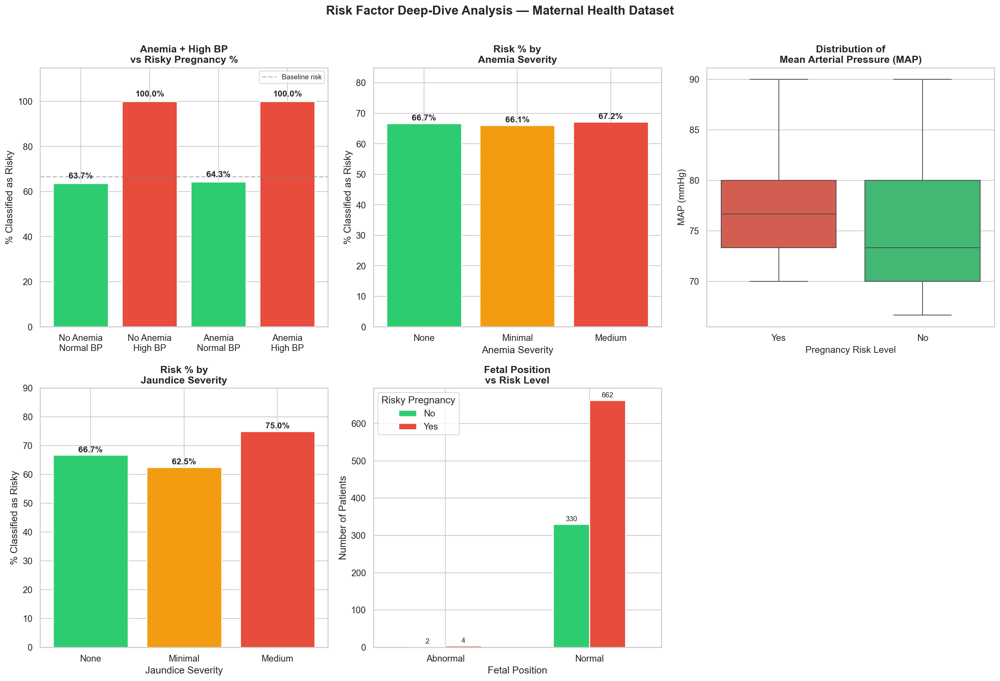
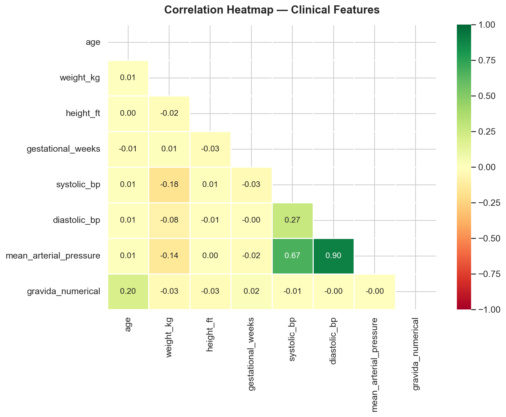
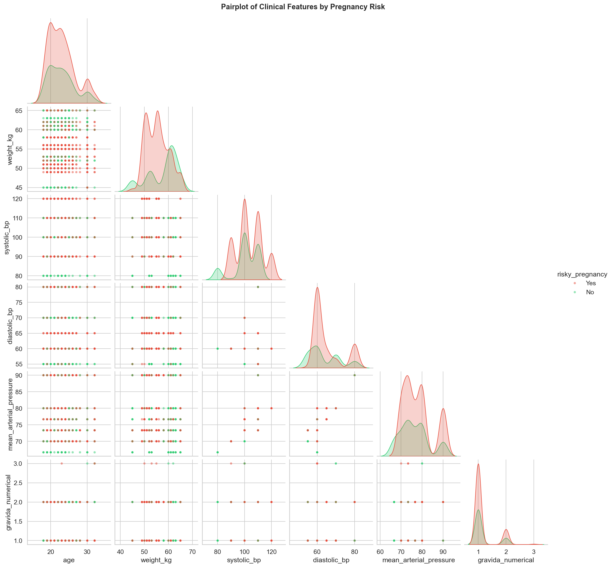
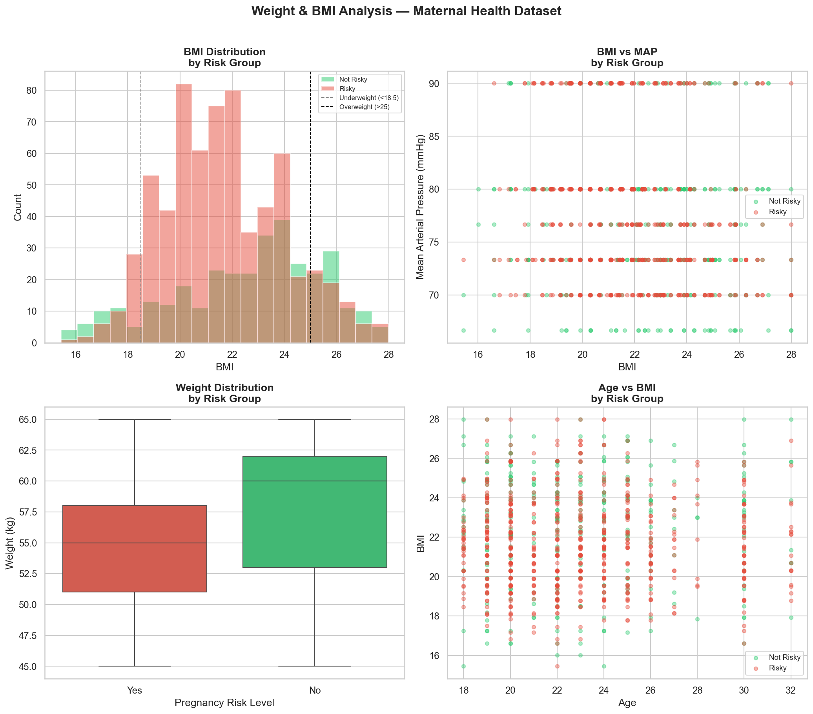

# Maternal Health EDA

Exploratory Data Analysis on a maternal health dataset originally recorded in Bengali. This project covers data cleaning, translation, feature engineering, and multiple analysis tracks to identify risk factors in pregnancy.

---

## Dataset

- **File:** `Maternal_DS.xlsx`
- **Source:** https://zenodo.org/records/14537882
- **Rows:** 998 patients
- **Language:** Column names in Bengali are automatically translated to English using `deep_translator`
- **Target variable:** `risky_pregnancy` (Yes / No)

**Features include:** age, weight, height, blood pressure, gestational age, gravida, anemia, jaundice, fetal position, fetal heartbeat, urine albumin & sugar, VDRL, HRsAG

---

---

## Analysis

### 1. Data Cleaning & Initial EDA (`data_cleaning_eda.py`)
#### Data Cleaning Steps
The raw dataset presented two key challenges before any analysis could begin:

##### Language barrier
All column names were in Bengali. Rather than renaming them manually, deep_translator was used to automatically translate each column name to English via Google Translate, then convert the result to snake_case for clean programmatic access.
##### Unstructured fields
Blood pressure was recorded as "120/80", weight as "50 kg", height as "5.2''", and gravida as "1st" or "2nd". 
No missing values were found across all 998 rows and 18 columns.
#### Feature Engineering
Calculated two new clinical features from the raw data:

##### Mean Arterial Pressure (MAP)
Calculated using the standard formula: MAP = (Systolic + 2 × Diastolic) / 3. MAP is a more stable measure of perfusion pressure than systolic BP alone and is widely used in obstetric risk assessment.
##### Numerical Gravida
Extracted from ordinal strings (e.g. "1st" → 1) using regex, enabling gravida to be used as a numerical feature in grouping and correlation analyses.

### 2. Risk Factor Analysis (`risk_factor_analysis.py`)
#### Overview
This analysis investigates how individual and combined clinical risk factors relate to pregnancy risk classification. Five plots examine blood pressure, anemia, MAP, jaundice, and fetal position as potential indicators of risk.

#### Visualisations
##### Plot 1 : Anemia and High BP vs Risky Pregnancy %
This plot examines whether the combination of anemia and high BP (systolic ≥ 120) drives risk classification more than either factor alone:

Patients with no anemia and normal BP have a 63.7% risk rate where the baseline in the dataset is 66.6%.
Patients with anemia and normal BP show a similar 64.3% risk rate, indicating that anemia alone does not contribute a risky pregnancy.
Both groups with high BP — regardless of whether anemia is present — are classified as risky 100% of the time, making high blood pressure the single strongest predictor in the entire dataset.

##### Plot 2 : Risk % by Anemia Severity

Across all the three anemia categories, None (66.7%), Minimal (66.1%), and Medium (67.2%), the risk percentage stays within 1% of each other. The near-flat pattern shows that anemia severity has no meaningful independent effect on pregnancy risk classification.

##### Plot 3 : Distribution of MAP by Risk Group
The boxplot shows an upward shift in MAP for the risky pregnancy group compared to the non-risky group:

The risky group has a median MAP of approximately 77 mmHg, with an IQR between ~74–80 mmHg and a narrow overall spread.
The non-risky group has a lower median MAP of approximately 73 mmHg, a wider IQR (~70–80 mmHg), indicating greater variability among lower risk patients.
The tighter, higher distribution in the risky group suggests that elevated MAP is a consistent characteristic of risky pregnancies.

##### Plot 4 : Risk % by Jaundice Severity

Patients with no jaundice show a 66.7% risk rate, consistent with the baseline.
Minimal jaundice shows a slight dip to 62.5%, which can be due to the small sample size.
Medium jaundice shows a rise to 75%, suggesting that more severe jaundice may be associated with higher pregnancy risk in this dataset.

##### Plot 5 : Fetal Position vs Risk Level

The vast majority of patients (330 non-risky, 662 risky) have a Normal fetal position.
Only 6 patients have an Abnormal fetal position (2 non-risky, 4 risky), making it difficult to perform analysis.
Abnormal fetal position is in this dataset is not a useful risk indicator.



### 3. Correlation & Multivariate Analysis (`correlation_analysis.py`)
#### Overview
This analysis examines the linear relationships between all the numerical clinical features using a correlation heatmap, and visualises how pairs of features separate the two risk groups using a pairplot.

#### Visualisations
##### Plot 1 : Correlation Heatmap

* MAP and diastolic BP (0.90) show the strongest correlation in the dataset.
* MAP and systolic BP (0.67) show a strong positive correlation.
* Systolic and diastolic BP (0.27) show a weak positive correlation, meaning patients with higher systolic readings tend to also have slightly higher diastolic readings.
* Age and gravida_numerical (0.20) show a weak positive correlation, older patients have had more pregnancies on average.
* Systolic BP and weight_kg (-0.18) show a slight negative correlation, which is counterintuitive and likely reflects the limited weight range in this cohort (45–65 kg) rather than a true clinical relationship
* All remaining pairs are effectively at zero, meaning age, weight, height, and gestational weeks are largely independent of each other and of blood pressure in this dataset


  
##### Plot 2 : Pairplot of Clinical Features by Risk Group

The pairplot indicates that BP-related features (systolic BP, diastolic BP, and MAP) provide the clearest separation between risk groups. The risky group consistently shows broader, right-shifted distributions compared to the tighter, lower centred non-risky group. Features like age, weight, and gravida show similiar distributions across both groups, offering no meaningful separation. 




### 4. Weight & BMI Analysis (`BMI_analysis.py`)
#### Overview
This analysis parses the raw weight (kg) and height (ft) string fields into numerical values, converts height to metres, and computes a proxy BMI. Patients are then classified into WHO BMI categories to examine whether body composition is associated with pregnancy risk.

#### Feature Engineering
* Height conversion: Height was recorded in feet. Converted it into metres using height_m = height_ft × 0.3048
* BMI calculation: BMI = weight_kg / height_m²
* BMI categories: Classified using standard WHO thresholds : Underweight (<18.5), Normal (18.5–24.9), Overweight (25–29.9)

#### Visualisations
##### Plot 1 : BMI Distribution by Risk Group
Both risk groups follow a similar bell-shaped distribution centred around BMI 20–24, with the majority of patients falling within the Normal range. The dashed reference lines at 18.5 and 25 show that only a small number of patients fall in the Underweight or Overweight categories.
This shows that BMI is not a differentiating factor between risk groups.

##### Plot 2 : BMI vs MAP by Risk Group
Risky patients (red) are concentrated in the higher MAP bands (80–90 mmHg) across all BMI values, while non-risky patients (green) cluster in the lower bands (~70 mmHg).
This shows that MAP is the key risk driver, and BMI has no effect on that relationship.

##### Plot 3&4 : Weight Distribution, Age vs BMI by Risk Group
Weight and age have no effect on preganacy risk level in this dataset.




---

## Summary of Key Findings

| Factor | Finding |
|---|---|
| High BP | 100% of high-BP patients classified as risky. This is the strongest predictor |
| HRsAG | Positive results appear exclusively in the risky group (16.4%) |
| VDRL | No predictive value |
| Anemia | Not a standalone predictor; risk percentage is similar across severity levels |
| BMI / Weight | No meaningful separation between risk groups |
| Age | Similar distribution across risk groups|

---

## Setup & Usage

**Install dependencies:**
```bash
pip install -r requirements.txt
```

**Run any script:**
```bash
python scripts/test.py
python scripts/risk_factor_analysis.py
python scripts/correlation_analysis.py
python scripts/BMI_analysis.py
```

> **Note:** Update the `pd.read_excel(...)` path in each script to point to your local copy of `Maternal_DS.xlsx`, or place the file in the same directory as the script and use just the filename.

---

## Requirements

- Python 3.8+
- pandas, numpy, matplotlib, seaborn, openpyxl, deep-translator
